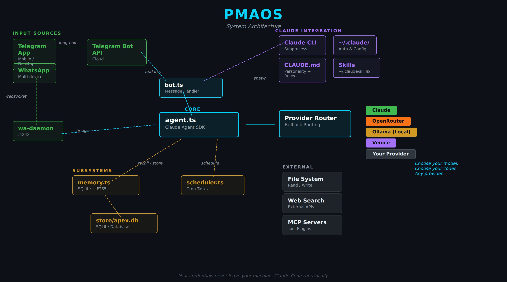

<p align="center">
  
</p>

<h1 align="center">PMAOS</h1>
<p align="center">
  <strong>Self-hosted AI assistant framework built on Claude Code SDK.</strong><br>
  Multi-agent fleet. Privacy-aware routing. Persistent memory. Delivered to your phone.<br>
  Any provider. Any model. Yours to build.
</p>

<p align="center">
  <a href="#quick-start">Quick Start</a> &bull;
  <a href="#architecture">Architecture</a> &bull;
  <a href="#features">Features</a> &bull;
  <a href="#comparison">Comparison</a> &bull;
  <a href="#security-model">Security</a> &bull;
  <a href="#contributing">Contributing</a>
</p>

---

## What Is This

PMAOS is a personal AI assistant that runs on your own hardware. Not a chat wrapper. Not a workflow builder. A fully autonomous assistant with specialized agents, encrypted secrets, structured knowledge management, and multi-platform messaging -- all self-hosted, all yours.

Built on the [Claude Code SDK](https://docs.anthropic.com/en/docs/claude-code-sdk), PMAOS agents have real tool use: file system access, code execution, web search, browser automation. They don't just generate text. They execute.

```
You (Telegram/Discord/Signal/Matrix/WhatsApp/Slack)
  |
  PMAOS (primary bot -- conversation, routing, memory)
  |
  +-- Agents (research, code, creative, conversation processing)
  +-- Providers (Claude, Venice, OpenRouter, Ollama -- auto-routed)
  +-- Memory (3-tier retrieval, semantic search, consolidation)
  +-- Vault (Obsidian integration, structured knowledge routing)
  +-- Workflow (DAG engine, cron triggers, webhooks)
  +-- Security (Paladin policy engine, prompt guard, content quarantine)
```

## Quick Start

```bash
# Clone
git clone https://github.com/YOUR_USERNAME/pmaos.git
cd pmaos

# Install
npm install

# Configure
cp .env.example .env        # Add your API keys
cp CLAUDE.md.template CLAUDE.md  # Define your bot's personality

# Build and launch
npm run build
pm2 start ecosystem.config.cjs --only paladin   # Security gate first
pm2 start ecosystem.config.cjs --only your-bot   # Then your bot

# Check status
pm2 status
```

### Requirements

- Node.js 20+
- [PM2](https://pm2.keymetrics.io/) (`npm install -g pm2`)
- [age](https://github.com/FiloSottile/age) (secret encryption)
- [ffmpeg](https://ffmpeg.org/) (voice pipeline, optional)
- A Telegram bot token ([BotFather](https://t.me/botfather))
- A Claude API key ([Anthropic Console](https://console.anthropic.com/))

<h2 id="architecture">Architecture</h2>

```
                         Messaging Layer
              +--------+--------+--------+--------+--------+
              |Telegram |Discord | Matrix | Signal |WhatsApp|
              +--------+--------+--------+--------+--------+
                              |
                    +---------+---------+
                    |    Primary Bot    |
                    |  (conversation,   |
                    |   routing, tools) |
                    +---------+---------+
                              |
         +--------------------+--------------------+
         |                    |                    |
   +-----+------+    +-------+-------+    +-------+-------+
   |   Paladin  |    |    Memory     |    |    Bridge     |
   |  (security |    |    System     |    |  (task queue) |
   |   engine)  |    +-------+-------+    +-------+-------+
   +-----+------+           |                    |
         |            +-----+-----+       +------+------+
    +----+----+       |FTS5 search|       | Agent Fleet |
    |Allowlist|       |Vector sim.|       +------+------+
    |Blocklist|       |Salience   |              |
    |Rate lim.|       |Consolidate|       +------+------+------+---------+
    |Approvals|       +-----------+       |Research|Code |Creative|Scribe  |
    +---------+                           +--------+-----+--------+--------+
         +--------------------+
         |     Vault Sync     |
         | (Obsidian, git)    |
         +--------------------+
                |
    +-----------+-----------+
    |  Tasks    | Projects  |
    |  Notes    | Research  |
    |  Daily    | Decisions |
    +-----------+-----------+
```

### Core Systems

| System | What It Does |
|--------|-------------|
| **Paladin** | Security policy engine. Every bash command, file write, and API call passes through Paladin first. Allowlists, blocklists, rate limits, approval gates, injection detection. Hot-reloadable via `config/policy.yaml`. |
| **Provider Router** | Routes messages to the right AI provider based on sensitivity, cost, and capability. Sensitive data goes to zero-retention providers automatically. |
| **Memory** | 3-tier retrieval (FTS5 full-text + sqlite-vec embeddings + salience scoring). Memories consolidate over time. Old patterns strengthen. Noise decays. |
| **Bridge** | Inter-agent task queue with dedup, dispatch, and result delivery. Agents work independently, results flow back through the bridge. |
| **Scribe** | Processes conversation history into structured vault entries. Tasks, decisions, research, and notes -- automatically routed to the right place. |
| **Workflow Engine** | DAG executor with topological sort. Cron, event, and webhook triggers. 10 action types (LLM, fetch, shell, email, file, transform, condition, loop, parallel, notify). |

<h2 id="features">Features</h2>

### Multi-Agent Fleet

Not a single chatbot. A fleet of specialized agents managed by PM2, connected through a bridge task queue.

| Agent | Role | Example |
|-------|------|---------|
| **Primary** | Conversation, routing, memory, tool use | "What's on my plate today?" |
| **Research** | Deep dives, data gathering, analysis | "Research the best VPN protocols for self-hosting" |
| **Code** | Build, refactor, debug, test | "Refactor the auth module to use JWT" |
| **Creative** | Copy, proposals, social content, media | "Write a product launch email for the new feature" |
| **Scribe** | Conversation processing, vault management | Runs nightly, extracts tasks/decisions/notes |
| **Council** | Multi-perspective decision engine | "Stress test this architecture decision" |

Agents run as independent PM2 processes. Add more by dropping a `CLAUDE.md` and `.env` into `bots/your-agent/`.

### Privacy-Aware Provider Routing

Other projects let you pick your provider. PMAOS picks for you -- based on what you're saying.

```
"Check the build status"           -> Claude (fast, capable, default)
"How much is in the savings?"      -> Venice (zero data retention)
"Summarize this local document"    -> Ollama (never leaves your machine)
"Compare these three frameworks"   -> OpenRouter (model variety)
```

The `SensitivityClassifier` analyzes every message for PII, financial data, crypto addresses, medical info, and personal context. Sensitive messages route to zero-retention providers automatically. No manual switching.

Add your own provider by implementing the `ChatProvider` interface. Template included.

### Persistent Memory

Not just conversation history. A memory system that learns.

- **FTS5 full-text search** for keyword retrieval
- **sqlite-vec embeddings** for semantic similarity
- **Salience scoring** with Ebbinghaus-inspired decay (important things stay, noise fades)
- **Memory consolidation** synthesizes patterns across conversations
- **Namespace isolation** per agent with shared namespace for fleet coordination
- **Fact extraction** pulls structured information from natural conversation

```
You: "We decided to go with PostgreSQL for the new project"
       |
       v
Memory: { content: "PostgreSQL chosen for new project",
          sector: "semantic", salience: 4.2,
          topic_key: "project-database" }
```

### Structured Knowledge (Obsidian Vault)

Bidirectional integration with Obsidian. Not "search your docs" -- structured routing.

| What You Say | Where It Goes |
|-------------|---------------|
| "Add a task: wire up the API" | `Tasks.md` under the right project section |
| "Start a project for the NAS build" | `Projects/NAS Build/NAS Build.md` (from template) |
| "We decided to use Caddy over Nginx" | Project decision log with date + reasoning |
| "Save a note on Docker networking" | `Notes/Docker networking.md` with YAML frontmatter |
| Research results | `Research Results/YYYY-MM-DD/topic.md` or project folder |

Git-tracked. Every write auto-commits. Full audit trail.

### Voice Pipeline

Full speech-to-text and text-to-speech with cascade fallback.

```
STT: Groq Whisper -> Venice STT -> (local fallback)
TTS: ElevenLabs -> Piper (local, zero cost) -> Venice TTS -> (skip)
```

Send a voice message on Telegram. Get a voice response back. Or text. Your choice.

### The Council (Decision Engine)

Three independent agents analyze your question in parallel, each with a different mandate:

| Seat | Codename | Role |
|------|----------|------|
| Optimist | **Vanguard** | Strongest version of the idea, upside pathways |
| Devil's Advocate | **Sentinel** | Stress tests, blind spots, hidden risks |
| Neutral Analyst | **Arbiter** | Objective trade-off mapping, no bias |

Results synthesize into agreements (ground truth), divergences (decision points), and a recommendation with next steps. Prompt templates included in `council/`.

### Multi-Platform Messaging

| Platform | Status | Auth |
|----------|--------|------|
| Telegram | Primary | Bot token (BotFather) |
| Discord | Supported | Bot token |
| Matrix | Supported | Access token |
| Signal | Supported | signal-cli REST API |
| WhatsApp | Supported | whatsapp-web.js (QR auth) |
| Slack | Supported | User OAuth token |
| Dashboard | Built-in | Token auth |
| Kiosk/Avatar | Built-in | Local network |

### Workflow Engine

Define workflows in YAML. Execute as DAGs with topological sort.

```yaml
name: daily-research
trigger:
  type: cron
  schedule: "0 2 * * *"
steps:
  - id: gather
    action: llm
    prompt: "Summarize the top 5 stories in AI today"
  - id: save
    action: file
    depends_on: [gather]
    path: "research/daily/{{date}}.md"
```

10 action types: `llm`, `fetch`, `shell`, `email`, `file`, `transform`, `condition`, `loop`, `parallel`, `notify`.

### Scheduling

Cron-based task execution with agent scoping.

```bash
# Create a scheduled task
node dist/schedule-cli.js create "Check for security updates" "0 9 * * 1"

# List / pause / resume
node dist/schedule-cli.js list
node dist/schedule-cli.js pause <id>
node dist/schedule-cli.js resume <id>
```

### Dashboard

Single-file SPA. No build step. Token auth.

- Agent fleet status (PM2 processes)
- Bridge task queue monitoring
- Memory statistics and browsing
- Token usage and cost tracking
- Quick dispatch to any agent

### Spice System (Voice Personality)

Rotating personality dimensions that keep responses from going stale. 10 dimensions (cadence, warmth, humor, energy, perspective, etc.) with randomized rotation every N messages.

Register detection adjusts tone based on context -- protective for family mentions, strategic for planning, warm for appreciation.

<h2 id="security-model">Security Model</h2>

Defense-in-depth. Seven layers, not bolted on -- built in.

| Layer | What It Does |
|-------|-------------|
| **Paladin Policy Engine** | Command allowlisting, file access control, rate limiting, approval gates. First line of defense. |
| **Prime Directives** | Hardcoded safety rules in `src/prime-directives.ts`. Cannot be overridden by config or prompt. |
| **Prompt Sanitization** | 30+ injection patterns across 6 categories. Scores every inbound message. Homoglyph and encoded payload detection. |
| **Content Quarantine** | Dual-LLM verification for untrusted content (web scrapes, file uploads). |
| **Secret Substitution** | API keys and tokens replaced with placeholders before reaching the AI model. age-encrypted at rest. |
| **Cedar ABAC Policies** | Attribute-based access control for fine-grained permission management. |
| **Namespace Isolation** | Each agent operates in its own memory namespace. Cross-agent reads require explicit shared namespace. |

<h2 id="comparison">How PMAOS Compares</h2>

|  | **PMAOS** | **Agent Zero** | **OpenClaw** | **CrewAI** | **IronClaw** |
|--|---------|--------------|------------|----------|------------|
| Self-hosted | Yes | Yes | Yes | Library | Yes |
| Multi-agent fleet | PM2 managed, named roles | Generic sub-agents | No | Task crews | No |
| Privacy-aware routing | Automatic per-message | No | Manual | No | TEE isolation |
| Messaging (multi-platform) | 8 adapters | Telegram plugin | 25+ platforms | No | API only |
| Persistent memory | 3-tier + consolidation + decay | Persistent (basic) | Basic | No | No |
| Structured vault (Obsidian) | Full bidirectional sync | No | No | No | No |
| Voice (STT + TTS) | Cascade fallback (4 providers) | No | Basic | No | No |
| Workflow engine | DAG + cron + webhooks | No | Via skills | Task pipelines | No |
| Security suite | 7 layers (Paladin, ABAC, quarantine) | Docker sandbox | Basic | No | TEE + WASM sandbox |
| Decision engine | 3-agent parallel Council | No | No | Possible | No |
| Encrypted secrets | age AES-256 | No | No | No | SGX enclave |
| Dashboard | Built-in SPA | No | No | No | No |
| Built on Claude Code SDK | Yes | Yes | No | No | No |

**Where each lives:**

- **Agent Zero** is the closest competitor. Plugin ecosystem, Docker execution, SKILL.md standard. But no named agent fleet, no vault integration, no privacy routing, no voice, no workflow engine.
- **OpenClaw** has massive reach but had 9 CVEs in 4 days (March 2026). Breadth over depth.
- **CrewAI** is an orchestration library, not a running product. You build on it. PMAOS ships ready to go.
- **IronClaw** has the strongest security story (TEE/WASM). But it's an API framework, not a personal assistant.

## Project Structure

```
pmaos/
  CLAUDE.md.template      # Bot personality template (you customize this)
  ecosystem.config.cjs    # PM2 process configuration
  .env.example            # All supported environment variables
  package.json
  tsconfig.json

  config/
    policy.yaml           # Paladin security rules (hot-reloadable)

  council/                # Decision engine prompt templates
    vanguard.md.template  # Optimist Strategist
    sentinel.md.template  # Devil's Advocate
    arbiter.md.template   # Neutral Analyst

  bots/
    worker-template/      # Template for new worker agents

  src/
    index.ts              # Startup, server init, graceful shutdown
    bot.ts                # Message handling, command routing
    worker.ts             # Generic worker base class
    config.ts             # Centralized configuration
    db.ts                 # SQLite schema, migrations
    bridge.ts             # Inter-agent task queue
    paladin.ts            # Security policy engine
    memory.ts             # Tiered memory system
    voice.ts              # Voice I/O pipeline
    dashboard.ts          # Web dashboard (single-file SPA)

    providers/            # AI provider abstraction layer
      claude-*.ts         # Claude (API + Agent SDK)
      venice-provider.ts  # Venice (zero-retention)
      openrouter-*.ts     # OpenRouter (100+ models)
      ollama-provider.ts  # Ollama (local models)
      router.ts           # Sensitivity-based routing
      sensitivity.ts      # PII/financial/personal classifier
      template-*.ts       # Add your own provider

    scribe/               # Vault organization agent
    workflow/             # DAG workflow engine
    wraith/               # AI defense scan modules
    learning/             # Adaptive learning system

  scripts/
    restart.sh            # Graceful delayed restart
    vault-commit.sh       # Auto-commit vault changes
    notify.sh             # Telegram notification delivery
    encrypt-env.sh        # age encryption for .env files
    scan-skill.sh         # Skill security scanner (YARA + behavioral)
    safe-mode.sh          # Reduced-feature recovery mode
    emergency/            # Recovery scripts (5 modules)

  assets/                 # Architecture diagrams and screenshots
  templates/              # File templates (projects, notes)
  workspace/              # Runtime workspace
```

## Configuration

### CLAUDE.md

Your bot's personality, instructions, and context. Copy the template:

```bash
cp CLAUDE.md.template CLAUDE.md
```

Edit the `{{placeholders}}`: bot name, owner name, vault path, project root. This is what makes your bot yours.

### Environment Variables

All keys go in `.env` (encrypt to `.env.age` with `scripts/encrypt-env.sh`):

| Variable | Required | Description |
|----------|----------|-------------|
| `ANTHROPIC_API_KEY` | Yes | Claude API key |
| `TELEGRAM_BOT_TOKEN` | Yes | Telegram bot token (primary channel) |
| `TELEGRAM_CHAT_ID` | Yes | Your Telegram chat ID |
| `BOT_NAME` | Yes | Your bot's display name |
| `PROJECT_ROOT` | Yes | Absolute path to project directory |
| `VAULT_ROOT` | No | Path to Obsidian vault |
| `VENICE_API_KEY` | No | Venice AI (zero-retention provider) |
| `OPENROUTER_API_KEY` | No | OpenRouter (multi-model routing) |
| `GOOGLE_API_KEY` | No | Gemini (video understanding) |
| `DISCORD_TOKEN` | No | Discord bot token |
| `SLACK_BOT_TOKEN` | No | Slack bot token |
| `MATRIX_ACCESS_TOKEN` | No | Matrix access token |
| `MATRIX_HOMESERVER_URL` | No | Matrix homeserver URL |
| `PALADIN_APPROVAL_TOKEN` | No | Approval gate authentication |
| `PALADIN_PORT` | No | Paladin port (default: 3150) |

Full list in `.env.example`.

### Adding Agents

1. Create `bots/your-agent/`
2. Add `.env` with `WORKER_NAME=your-agent` and specialties
3. Add `CLAUDE.md` with the agent's role and instructions
4. Add entry to `ecosystem.config.cjs`
5. `pm2 start ecosystem.config.cjs --only your-agent`

The bridge handles dispatch and result delivery automatically.

### Adding Providers

1. Copy `src/providers/template-provider.ts`
2. Implement the `ChatProvider` interface
3. Register in `src/providers/index.ts`
4. Add routing rules in `src/providers/router.ts`

## Development

```bash
npm run dev           # Dev mode (auto-restart on changes)
npm run typecheck     # Type check
npm test              # Run tests
npm run test:watch    # Tests in watch mode
npm run build         # Build for production
```

## Scripts

| Script | Purpose |
|--------|---------|
| `restart.sh` | Safe PM2 restart (avoids mid-handler kills) |
| `vault-commit.sh` | Git-commit vault changes with description |
| `notify.sh` | Send Telegram notification |
| `encrypt-env.sh` | Encrypt .env files with age |
| `decrypt-bot-envs.sh` | Decrypt bot .env files at startup |
| `scan-skill.sh` | Security scan skills before install |
| `safe-mode.sh` | Reduced-feature recovery mode |
| `snapshot.sh` | Full system state snapshot |
| `heartbeat.sh` | Process health check |
| `pre-change-backup.sh` | Pre-deployment backup |

<h2 id="contributing">Contributing</h2>

Contributions welcome. See [CONTRIBUTING.md](CONTRIBUTING.md) for guidelines.

Areas where help is especially useful:
- New provider implementations (Gemini, Groq chat, Mistral)
- Messaging platform adapters
- Workflow action types
- Memory retrieval strategies
- Dashboard UI improvements
- Documentation and examples

## Security

See [SECURITY.md](SECURITY.md) for the threat model and how to report vulnerabilities.

## License

MIT. See [LICENSE](LICENSE).

---

<p align="center">
  Built with <a href="https://docs.anthropic.com/en/docs/claude-code-sdk">Claude Code SDK</a>
</p>
